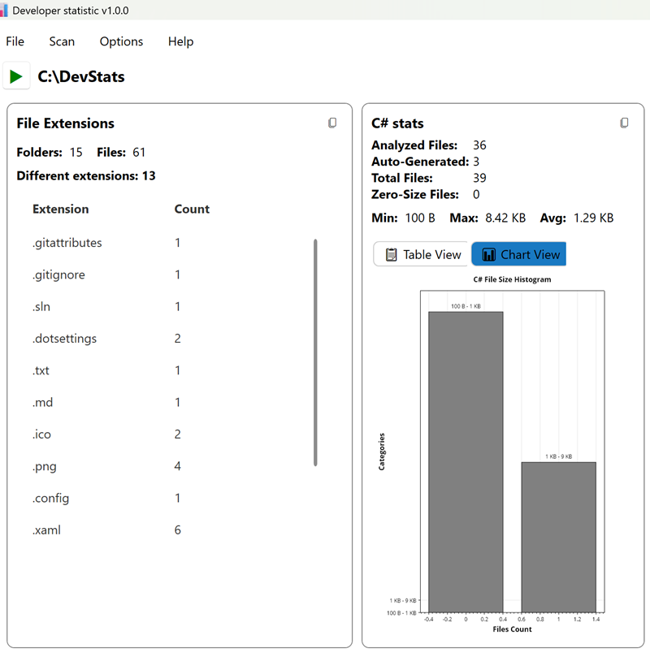
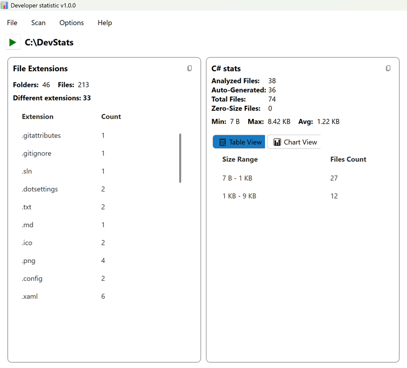

# DevStats – Repository Analysis Tool 📊

DevStats is a WPF application for analyzing C# repositories.
It scans your entire solution or project folder, gathers file statistics, detects auto-generated code, and presents the results in a clean, interactive dashboard.
Optional `.gitignore` support lets you exclude ignored files from the analysis when desired.

---

## Features

* Repository-wide analysis of all files in a C# project
* Optional `.gitignore` support to skip ignored files and folders
* File size statistics with histograms and tables
* Auto-generated file detection and exclusion
* Visual dashboard with charts and sortable tables
* Markdown export for documentation and sharing
* Plugin system to extend analysis with custom C# modules

---

## Screenshots

With `.gitignore` enabled:


Showing all files:


---

## Requirements

* .NET 9.0 or higher
* Windows operating system
* Visual Studio 2022 (recommended for building from source)

---
## Installation (for Users)

This application uses ClickOnce for a simple installation and automatic updates.

#### 1. Download the Installer

Click the link below to download the `setup.exe` installer.

### [**Download and Install DevStats**](https://raw.githubusercontent.com/AlexNek/DevStats/clickonce/setup.exe)

#### 2. Run the Installer

Your browser or Windows may show a security warning because the application is not from the Microsoft Store. This is expected.

*   **If you see a warning from Windows SmartScreen:**
    1.  Click **"More info"**.
    2.  Then, click **"Run anyway"**.

The installer will then download the application and its dependencies (.NET Desktop Runtime if needed) and launch DevStats. A shortcut will be added to your Start Menu.

#### 3. Automatic Updates

The application will automatically check for and install new updates each time it starts.

---

## Usage

1.  Launch **DevStats** from the Start Menu or desktop shortcut.
2.  Click the **Scan Folder** button.
3.  Select a folder containing a source code project.
4.  View the generated statistics and charts on the dashboard.

---

## For Developers

### Building from Source

If you want to build the project yourself, you will need:

*   **Visual Studio 2022** with the following workload:
    *   .NET desktop development

**Steps:**

1.  Clone the repository:
    ```bash
    git clone https://github.com/AlexNek/DevStats.git
    ```
2.  Open the `DevStats.sln` solution file in Visual Studio.
3.  Build the solution (Build > Build Solution or `Ctrl+Shift+B`).
    Or Build the project from command line:

   ```bash
   dotnet build
   ```
4.  Run the project (Debug > Start Debugging or `F5`).

### How the CI/CD Works

This repository is configured with AppVeyor for continuous integration and deployment:

1.  **Build:** When code is pushed to the `master` branch, AppVeyor builds the solution.
2.  **Publish:** It then publishes the project as a ClickOnce application.
3.  **Deploy to `clickonce` branch:** The build script force-pushes the published application files to the `clickonce` branch. This branch is the live update location for all installed applications.
4.  **Create GitHub Release:** AppVeyor also creates a new release on the [Releases page](https://github.com/AlexNek/DevStats/releases) and attaches a `.zip` file of the published artifacts as a backup.
---

## Configuration

DevStats uses `appsettings.json` for configuration. Available settings:

| Setting                      | Type      | Description                                                       |
| ---------------------------- | --------- | ----------------------------------------------------------------- |
| `ExcludeAutogeneratedFiles`  | Boolean   | Exclude auto-generated files from statistics                      |
| `AutogeneratedFilePatterns`  | String\[] | Patterns used to detect generated files                           |
| `HistogramMaxBins`           | Integer   | Maximum number of bins used for the file size histogram           |
| `AutogeneratedFileScanBytes` | Integer   | Number of bytes scanned when determining if a file is generated   |
| `UseGitIgnore`               | Boolean   | If enabled, files/folders listed in `.gitignore` will be excluded |

---

## Plugin System

DevStats includes a plugin architecture for extending functionality. You can add new statistics, customize analysis, or integrate with other tools.

### To create a plugin:

1. Implement the `ICardPlugin` interface.
2. Create the XAML and ViewModel for your plugin’s UI.
3. Register your plugin in the `Plugins` list:

   ```csharp
   var plugins = new List<ICardPlugin>
   {
       new FileExtensionCountCardPlugin(_appSettings),
       new CsStatisticsCardPlugin(_appSettings)
   };
   ```
4. Build the project and run the application.

> Note: This version uses a static plugin list for simplicity. A future enhancement could allow dynamic loading of external DLLs.

---

## Usage

1. Select your C# repository (solution or project folder).
2. Adjust settings, including whether to apply `.gitignore`.
3. Run analysis to view file extension stats, size distributions, and C#-specific metrics.
4. Export Markdown reports for documentation or sharing.

---

## Contributing

We welcome contributions:

1. Fork the repository
2. Create a feature branch
3. Commit your changes
4. Open a pull request

---

## License

This project is licensed under the MIT License – see the [LICENSE](LICENSE) file for details.

---

## Updates

Check the [Releases page](https://github.com/AlexNek/devstats/releases) for the latest updates and features.
- *V1.0.0*: initial release
